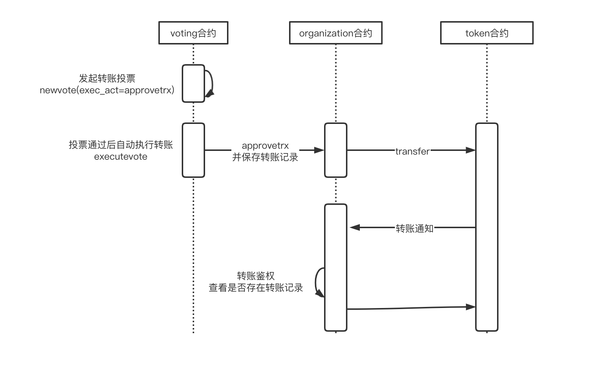

## 介绍
部署`organization`合约是创建一个组织的第一步，该合约内函数包括：

|    函数    | 说明                                                                                                                                                                                                                                                                                                                                                                                                                                                                                                                                          |
|----------- | ---------------------------------------------------------------------------------------------------------------------------------------------------------------------------------------------------------------------------------------------------------------------------------------------------------------------------------------------------------------------------------------------------------------------------------------------------------------------------------------------------------------------------------------------------- |
|`initorg`|初始化组织函数|
|`changename`|更改组织名称函数|
|`changedescid`|更改组织解决函数|
|`changeperm`|更改组织内部决策权限函数|
|`reg`|组织成员登记函数|
|`addplugin`|为组织添加插件函数|
|`approvetrx`|授权执行Token交易函数|
|`approvenft`|授权执行NFT交易函数|
|`mtransfer`|合约相关交易实际的执行函数|

## 安装部署
 一、首先将合约编译成WASM文件并部署到EOS
 
 ```
cleos set contract 合约名称 文件目录
 ```
 
二、执行`initorg`函数，输入组织名称、组织创始人、组织简介。注意：这里简介是一个IPFS的CID格式。

```
cleos push action 合约名称 initorg '["orgName","founder","Qm..."]'
```

三、然后是为组织安装插件，DAO把所有组织的功能都做成插件的形式，按需安装使用。调用`addplugin`进行安装，该函数的入参看注释应该能大概知道什么意思，这里说两个：第一个参数caller是调用该函数(addplugin)的EOS账号，因为是初始安装，所以只有创始人有权限；最后一个参数autonomous_acts说明一下，意思是当前安装的合约，哪些是需要进行自治的操作，例如：安装的是Token合约，那么可能代币的发行、挖矿、销毁等这些都是自治的操作。具体安装插件合约详情查看：[插件合约说明](https://github.com/jan-gogogo/dao/tree/main/plugins)  

##	运行
可以通过`changename`、`changedescid`、`changeperm`对组织的资料进行修改，之所以拆开成3个是因为方便支持对单独一项操作进行投票。

`approvetrx`、`mtransfer`相结合，控制组织合约的转账操作，如下图是一个转账的流程：

组织成员发起一笔转账申请，进行投票，调用`voting`合约`newvote()`函数，其中入参exec_act表示投票成功后自动执行的函数，这里填写`approvetrx`，任何从组织合约转出去的资产都是通过`approvetrx`，通过它来鉴权控制转账，而此函数一般是需要又`voting`来调用，通过这样来达到投票自治的目的。
